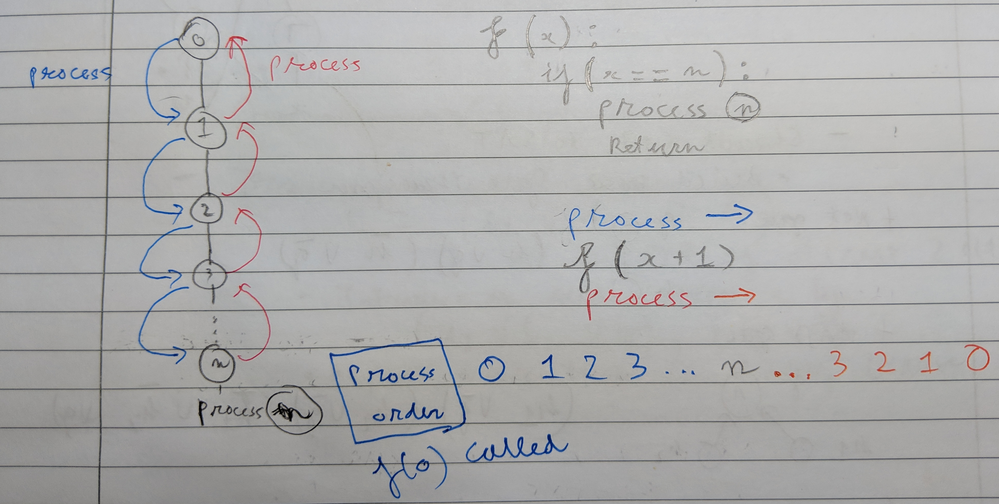
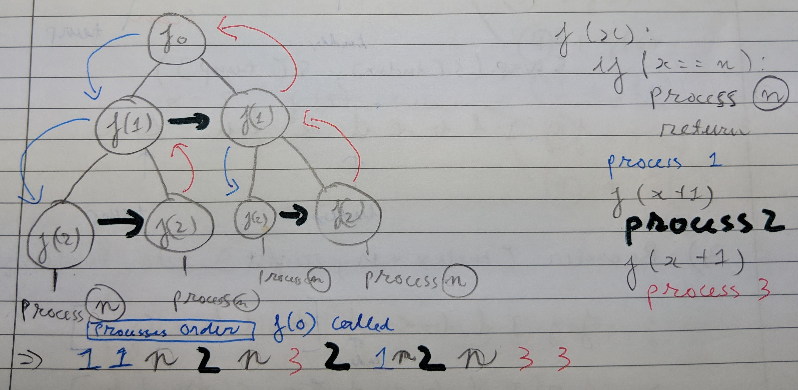

### Backtracking

### Backtracking - remove tail recursion

### DFS 1

### [DFS 2](https://github.com/dangkhoadl/Coursera-Discrete-Optimization/blob/master/2_Knapsack/DFBB.h)

### [N-Queen](https://github.com/dangkhoadl/my-Competitive-Programming-Notebook/tree/master/Problems/N_Queens)
