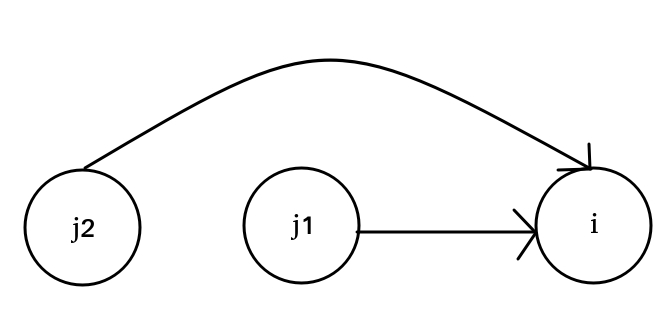

#### return values
- Normal return

```C++
// Return when dfs only generate 1 case
return dfs(x, str, i + 1)
```

- Search - backtrack

```C++
// Search for the true case
//     if >= 1 case true -> true
//     if all cases false -> false
FOR(x,0,4)
    if(dfs(x, str, i + 1)) return true;
```


# 1. DP
- Think about transition from state `j` -> state `i`
    + How `state i` is built from `state j`




```
dp[i] = dp[j] + 1;
dp[i] = dp[i-1] + 2; // j=i-1
```

- Check all possible condition

```C++
for(i in {0,N})
    // Case 1:
    if()
        dp[i] = dp[j] + 1

    // Case 2:
    if()
        dp[i] = dp[i-1] + 2

    // Case for:
    for() if()
        dp[i] = dp[i-2] + 3
```

- Usual conditions

```C++
for(i in {0,N})
    // Case exist i:
    if(exist.count(i))
        dp[i] = dp[j] + 1

    // Case not exist --> propagate dp
    else
        dp[i+1] = dp[i]
    

```


#### Transition

```C++
// state j --> state i (j < i)
for(int i=1; i<N; ++i) {
    for(int j=0; j<i; ++j) {
        // Case 1: Full relaxation condition
        if(dp[i] < dp[j] + A[i]) {
            // Relax
            dp[i] = A[i] + dp[j];

            // backtrack
            backtrack[i] = j;
        }

        // Relaxation Short-form
        dp[i] = max(dp[i], dp[j] + A[i]);
    }
}
```

#### Loop vs Recursive

- Recursive Bottom-Up
    + Easy to implement, natural approach
    + Not optimized in runtime (mostly complete search)
    + Try applying pruning to reduce time complexity
    + **Bottom-Up Recursive = DFS**

- Recursive Top-down
    + Topdown dfs optimized in time complexity than bottom-up dfs
    + Implementation complexity(easy -> hard): bottom up dfs < topdown dfs < loop 
    + Optimization complexity(slow -> fast): bottom up dfs < topdown dfs < loop
    + **Top-down Recursive = DFS**

- Loop
    + Hardest implementation
    + Most optimal
    + **Loop = BFS**, **BottomUp** (Only relaxable if last levels are settled, j < i)
    + Have a condition: If DP only relax in 1 direction (i.e increasing)

```C++
dp[i+1][w+A[i]] = max(dp[i+1][w+A[i]], dp[i][w])
    // i+1 > i, forall i
    // w+A[i] > w, for all w and A[i]

dp[j] = min(dp[j], dp[i] + A[i])
    // j > i, \forall i,j
```


# 2. Recursive/Backtrack DP template


```C++
bool get(int i) {
    // base cases + quick returns
    if(base_cases) return x;
    if(success_cond) {
        print(ans);
        return true;
    }

    // Check visited or dp
    vis[i] = true;

    // Branching
    next_ = ...+...;
    if(0<=next_ && next_< N && vis[next_] == false) {
        ans += ...;
        if(get(next_)) return true;
        ans -= ...;
    }

    next_ = ...-...;
    if(0<=next_ && next_< N && vis[next_] == false) {
        ans += ...;
        if(get(next_)) return true;
        ans -= ...;
    }

    for() {
        next_ = ;
        if(0<=next_ && next_< N && vis[next_] == false) {
            ans += ...;
            if(get(next_)) return true;
            ans -= ...;
        }
    }

    return false;
}
```
