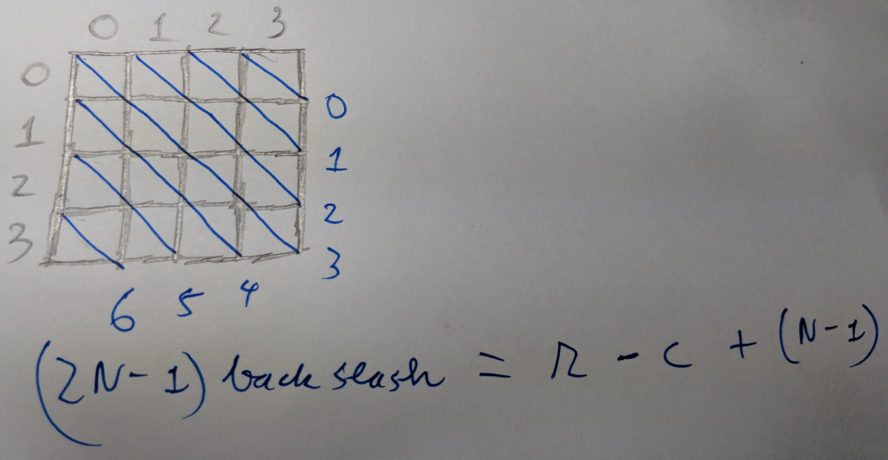

#### Notes
- When doing bfs, dfs. Check `vis` next node immediately to reduce time/space complexity

```C++
while(!Q.empty()) {
	int cur_node = Q.front();
	Q.pop();

	// Check vis here
	vis[cur_node] = 1;

	for(int &d:dirs) {
		int next_node = cur_node + d;

		if(vis[next_node] == 0) {
			// Update
			...

			// Also check vis here to reduce BFS complexity
			vis[next_node] = 1;
			Q.push(next_node);
		}
	}
}
```

#### Grid
```C++
/*____________________________________ DIR ____________________________ */
/*              [r][c]
*   up:         -1  0
*   down:        1  0
*   left:        0 -1
*   right        0  1
*   up-left     -1 -1
*   up-right    -1  1
*   down-right   1  1
*   down-left    1 -1
*/


/*________________________ check Inrange ______________________ */
// Check if x in [a,b)
inline bool inRange(int x, int a, int b) {
    return a <= x && x < b; 
}


/*________________________ 1D <-> 2D ______________________ */
/* Notes: i, j index at 0 */
// 2D(R*C) -> 1D
int cell = i*C + j;

// 1D -> 2D
int i = cell / C;
int j = cell % C;
```

#### Diagonals of a grid



