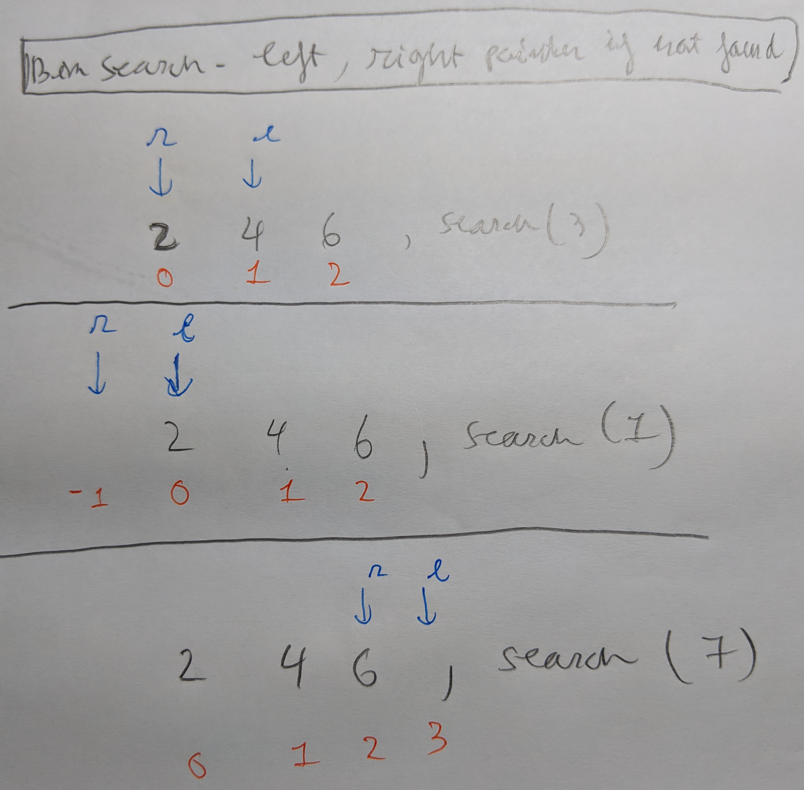

## Binary Search verifycation
- function f(x): check true/false. Eg: Rules, Requirements
	+ Easy to verify f(x)
	+ Than find x directly
- A determine range of x: [a,b] Eg: segments
	- [----------- optimized_value +++++++++++]
	- [+++++++++++ optimized_value -----------]

## Binary Search with left/right pointers



## C++ lower_bound, upper_bound pointers


## Decrease/ Increase pointers

```C++
// decrease
prev(it);   // --it
prev(it, 2); // it -= 2;

// increase
next(it);   // ++it
next(it, 2); // it += 2;
```
