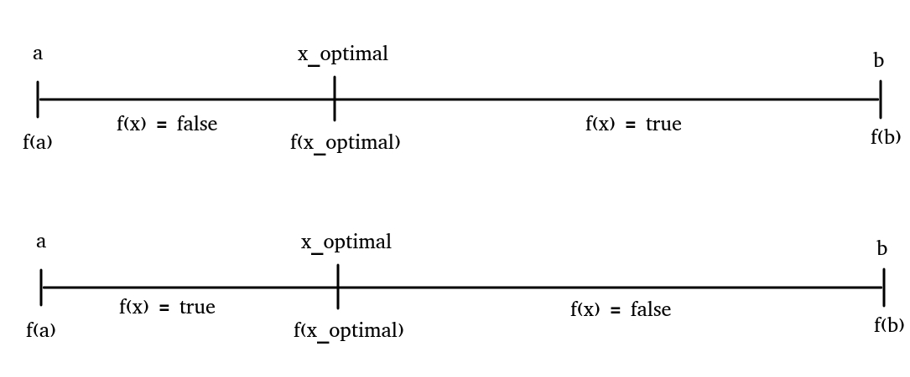

# Binary Search left/right pointer note
## Binary Search with left/right pointers


## C++ lower_bound, upper_bound pointers


## Decrease/ Increase pointers

```C++
// decrease
prev(it);   // --it
prev(it, 2); // it -= 2;

// increase
next(it);   // ++it
next(it, 2); // it += 2;
```

# Binary Search verification
- A determine range of x: `[a,b]`. Eg: segments
- function f(x): check true/false. Eg: Rules, Requirements
    + Find x to make f(x) optimal
    + Easy to verify f(x) true/false than find x directly



# Tenary search
- For finding max, min in a unimodal function f

    

